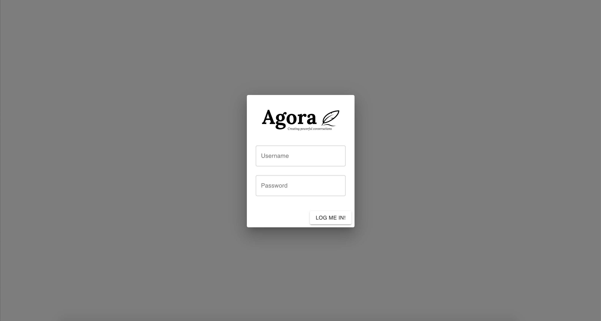
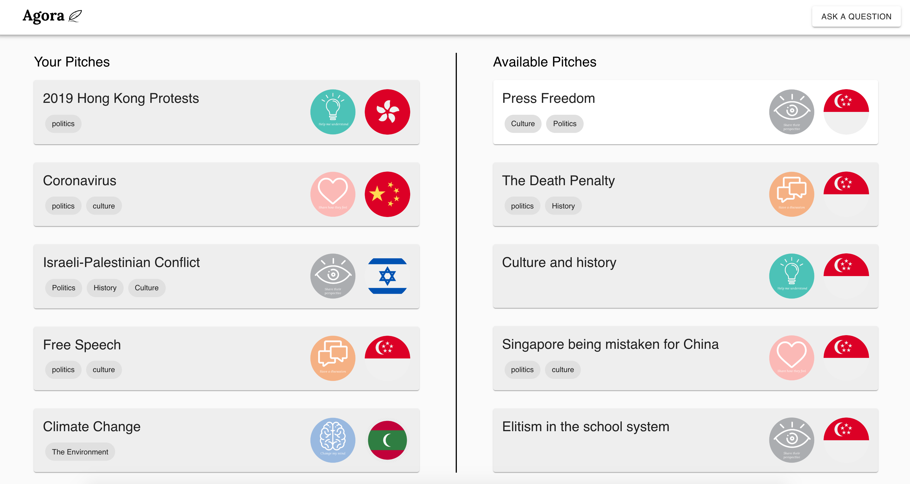
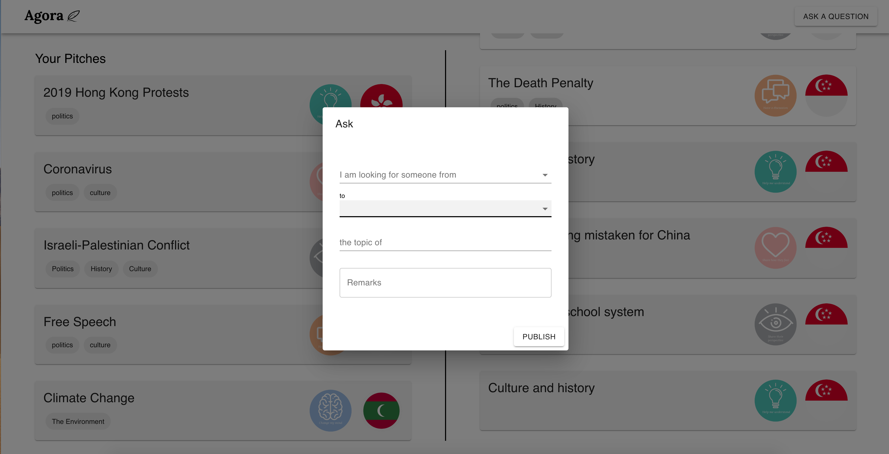
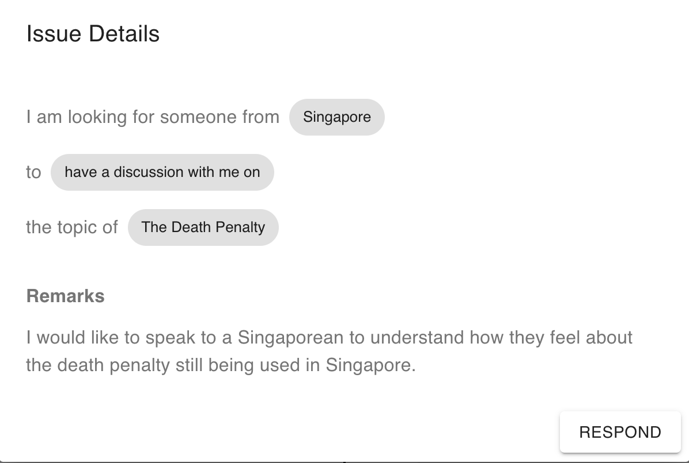
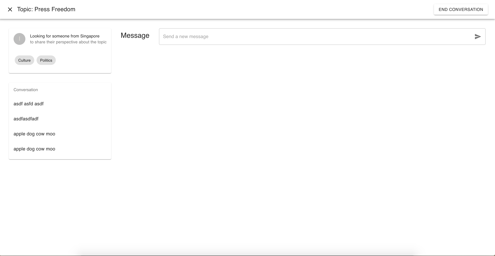

***Hack@CEWIT 2020 Submission***

# **Agora**

Agora is a web platform that creates powerful conversations between individuals, wherevever they are in the world. 

- ### **Login Page**
 

- ### **Landing Page**

At Agora's landing page, users are able to view their own pitches as well as pitches available for them to respond to.

- ### **Asking a Question**

- Users are able to create their own pitch by asking questions using question prompts on controversial topics. This allows users to obtain a first-hand account of an incident located abroad from another user located in that region.

### **Responding to an Issue**

- Users are able to respond to issues happening in their own country that are posted by other users

### **Conversation Page**
- Upon responding to an issue or getting the user's issue being responded to, it brings the user to a conversation page

